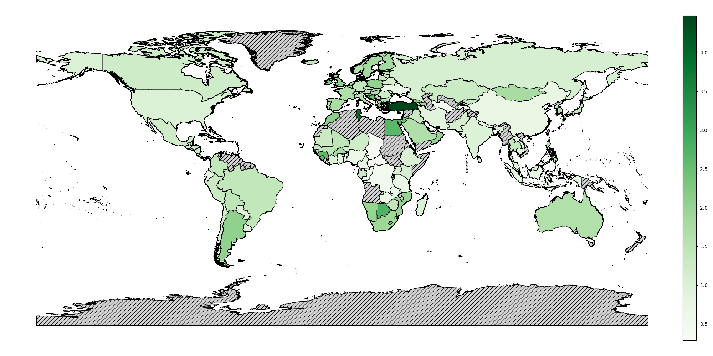

# Government spending as a percentage of total national wealth

Map



Year of government spending data used (wealth data is 2018)


Histogram


Bar chart of countries


## Usage

### Install dependencies

* pandas
* seaborn
* matplotlib
* geopandas

### Run

```sh
mkdir -p out
python main.py
```

## Data sources

### Government spending
https://data.worldbank.org/indicator/NE.CON.GOVT.KD?end=2021&start=2021&view=bar

### Total national wealth
https://databank.worldbank.org/source/wealth-accounts#

### Country shapefiles
https://gadm.org/download_world.html

## TODO

- Use alternate wealth data source

https://web.archive.org/web/20191014133603/https://www.credit-suisse.com/about-us/en/reports-research/global-wealth-report/tables.html
(the excel file is still accessible without using wayback machine; wayback machine was only used to find the url for the excel file)

- Find a single year where the most Government spending data is available (2015 is the latest for some countries, so try using Government spending in 2015 for all countries, and 2015 wealth in all countries)

